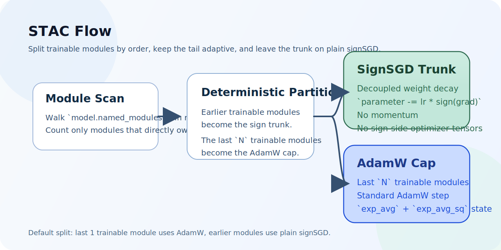

# stac-optimizer

[](https://pypi.org/project/stac-optimizer/)
[](https://www.python.org/downloads/release/python-3130/)
[](https://pytorch.org/)
[](https://github.com/smturtle2/stac-optimizer/actions/workflows/workflow.yml)

[English README](README.md) |
[영문 문서](docs/en/optimizer.md) |
[한국어 문서](docs/ko/optimizer.md) |
[벤치마크 JSON](docs/benchmark/research_benchmark.json)

STAC는 마지막 `N`개 trainable module만 AdamW로 두고, 그보다 앞선 trainable
module은 plain signSGD로 업데이트합니다. sign trunk는 momentum이 없고
sign 쪽 optimizer tensor도 만들지 않으므로, 전체 AdamW보다 optimizer-state
VRAM을 크게 줄이면서 tail 구간의 adaptivity는 유지합니다.

| 항목 | 값 |
| --- | --- |
| Python | `>=3.13` |
| PyTorch | `>=2.10` |
| 기본 분할 | 마지막 `1`개 trainable module만 AdamW |
| Sign trunk | plain signSGD, momentum 없음, sign-side state 없음 |
| 주요 조절값 | `last_n_modules`, `sign_lr_scale`, `foreach` |
| 분할 확인 | `optimizer.partition.sign_module_names`, `optimizer.partition.adamw_module_names` |

## 흐름



## 설치

```bash
python -m pip install stac-optimizer
```

개발 및 벤치마크 생성용 설치:

```bash
python -m pip install -e ".[dev]"
```

## 빠른 사용 예시

```python
import torch
from torch import nn

from stac_optimizer import STAC


model = nn.Sequential(
    nn.Linear(128, 64),
    nn.ReLU(),
    nn.Linear(64, 32),
    nn.ReLU(),
    nn.Linear(32, 10),
)

optimizer = STAC(
    model,
    lr=1e-3,
    last_n_modules=1,
    sign_lr_scale=1.0,
    weight_decay=1e-2,
    error_if_nonfinite=True,
)

loss = torch.nn.functional.mse_loss(
    model(torch.randn(8, 128)),
    torch.randn(8, 10),
)
loss.backward()
optimizer.step()
optimizer.zero_grad(set_to_none=True)

print(optimizer.partition.sign_module_names)
print(optimizer.partition.adamw_module_names)
```

`last_n_modules`는 trainable parameter를 직접 소유한 module만 셉니다.
`nn.Sequential` 같은 순수 컨테이너는 자기 자신이 parameter를 직접 갖지 않으면
자동으로 건너뜁니다.

## CUDA 벤치마크

이 저장소의 벤치마크는 held-out validation split, `5`개 paired seed,
깊은 residual 모델, epoch별 validation loss curve, 첫 step CUDA memory probe를
사용합니다.


`2026-03-19`, `torch 2.10.0+cu126`, `NVIDIA GeForce RTX 3070` 스냅샷:

| 설정 | Deep regression val loss | Deep classification val acc | TailNorm val acc | Optimizer state MB | Peak delta MB |
| --- | ---: | ---: | ---: | ---: | ---: |
| `STAC` 기본 (`last_n_modules=1`) | `0.016337` | `0.7037` | `0.7926` | `0.125` | `56.118` |
| `STAC` AdamW cap 확장 (`last_n_modules=4`) | `0.015252` | `0.7092` | `0.8041` | `24.149` | `81.271` |
| `AdamW` baseline | `0.013477` | `0.7207` | `0.8051` | `98.227` | `196.459` |

이번 측정에서 기본 STAC는 memory probe 기준 optimizer state를
`98.227 MB`에서 `0.125 MB`로 크게 줄였습니다. 더 넓은 AdamW cap은 어려운
태스크에서 품질을 더 회복했지만, 여전히 full AdamW보다 state 메모리가 훨씬
작았습니다. `last_n_modules`는 고정 상수라기보다 워크로드별 조절값으로 보는
편이 안전합니다.

## 검증

```bash
python -m pytest -q
python -m build
python -m twine check dist/*
python examples/research_benchmark.py --device cuda
```
