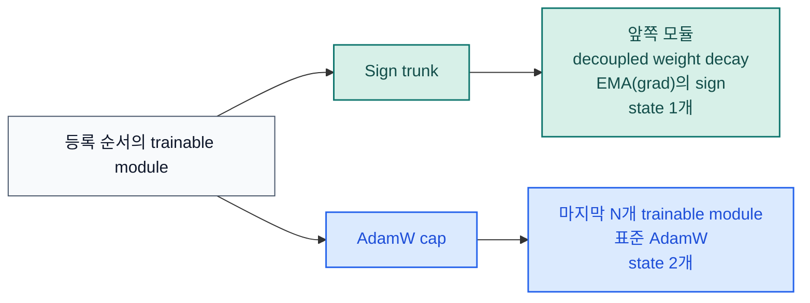

# stac-optimizer

[](https://pypi.org/project/stac-optimizer/)
[](https://www.python.org/downloads/release/python-3130/)
[](https://pytorch.org/)
[](https://github.com/smturtle2/stac-optimizer/actions/workflows/workflow.yml)

[English README](https://github.com/smturtle2/stac-optimizer/blob/main/README.md) |
[영문 문서](https://github.com/smturtle2/stac-optimizer/blob/main/docs/en/optimizer.md) |
[한국어 문서](https://github.com/smturtle2/stac-optimizer/blob/main/docs/ko/optimizer.md) |
[벤치마크 JSON](https://github.com/smturtle2/stac-optimizer/blob/main/docs/benchmark/research_benchmark.json)

STAC는 앞쪽 학습 모듈은 momentum-stabilized sign 업데이트로, 마지막 `N`개
학습 모듈은 AdamW로 유지하는 PyTorch 옵티마이저입니다. 목표는 전체 AdamW보다
optimizer-state VRAM을 낮추면서도 마지막 핵심 모듈의 adaptivity는 유지하는
것입니다.

| 항목 | 값 |
| --- | --- |
| Python | `>=3.13` |
| PyTorch | `>=2.10` |
| 기본 분할 | 마지막 `1`개 학습 모듈만 AdamW |
| 안정성 조절 | `sign_momentum`, `sign_lr_scale`, `error_if_nonfinite` |
| VRAM 조절 | `sign_state_dtype="auto"` 또는 `"bf16"` |
| 분할 확인 | `optimizer.partition.sign_module_names`, `optimizer.partition.adamw_module_names` |

## 구조



## 설치

```bash
python -m pip install stac-optimizer
```

개발용 설치:

```bash
python -m pip install -e ".[dev]"
```

## 빠른 사용 예시

```python
import torch
from torch import nn

from stac_optimizer import STAC


model = nn.Sequential(
    nn.Linear(128, 64),
    nn.ReLU(),
    nn.Linear(64, 32),
    nn.ReLU(),
    nn.Linear(32, 10),
)

optimizer = STAC(
    model,
    lr=1e-3,
    last_n_modules=1,
    sign_momentum=0.9,
    weight_decay=1e-2,
    error_if_nonfinite=True,
)

loss = torch.nn.functional.mse_loss(
    model(torch.randn(8, 128)),
    torch.randn(8, 10),
)
loss.backward()
optimizer.step()
optimizer.zero_grad(set_to_none=True)

print(optimizer.partition.sign_module_names)
print(optimizer.partition.adamw_module_names)
```

`last_n_modules`는 trainable parameter를 직접 소유한 모듈만 셉니다.
`nn.Sequential` 같은 순수 컨테이너는 자기 자신이 parameter를 직접 갖지 않으면
자동으로 건너뜁니다.

`sign_state_dtype="auto"`가 기본값입니다. CUDA에서 sign-state 메모리를 더
줄이고 싶으면 `"bf16"`으로 바꿀 수 있지만, 워크로드에 따라 작은 정밀도
트레이드오프가 있을 수 있습니다.

## CUDA 벤치마크

이 저장소의 연구용 벤치마크는 train/validation 분리, `5`개 paired seed,
optimizer 간 동일한 trial seed 기반 모델 초기화, epoch별 validation loss
curve, 첫 step CUDA 메모리 probe를 사용합니다.


`2026-03-19`, `torch 2.10.0+cu126`, `NVIDIA GeForce RTX 3070` 스냅샷:

| 설정 | 회귀 val loss | 분류 val loss | 분류 val acc | Optimizer state MB |
| --- | ---: | ---: | ---: | ---: |
| `STAC` 기본 (`last_n_modules=1`) | `0.045044` | `0.278679` | `0.9016` | `3.637` |
| `STAC` AdamW 구간 확장 (`last_n_modules=2`) | `0.044285` | `0.281579` | `0.9039` | `3.762` |
| `STAC` bf16 sign state | `0.045177` | `0.281705` | `0.9004` | `1.821` |
| `AdamW` baseline | `0.043068` | `0.280832` | `0.9055` | `7.270` |

이번 측정에서 기본 STAC는 AdamW 대비 optimizer state를 대략 절반 수준으로
줄였고, BF16 sign-state 변형은 이를 다시 한 번 더 낮췄습니다. 전체 방법론과
추가 ablation은 연결된 문서와 JSON 보고서에 정리했습니다.

그래프에는 LayerNorm 비중이 있는 분류 stress task도 포함되어 있습니다.
`last_n_modules`는 고정 상수가 아니라 조절 파라미터로 보는 편이 안전합니다.

## 검증

```bash
python -m pytest -q
python -m build
python -m twine check dist/*
python examples/research_benchmark.py --device cuda
```
