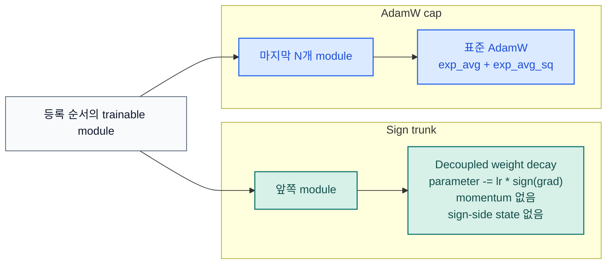

# stac-optimizer

[](https://pypi.org/project/stac-optimizer/)
[](https://www.python.org/downloads/release/python-3130/)
[](https://pytorch.org/)
[](https://github.com/smturtle2/stac-optimizer/actions/workflows/workflow.yml)

[English README](README.md) |
[영문 문서](docs/en/optimizer.md) |
[한국어 문서](docs/ko/optimizer.md) |
[벤치마크 JSON](docs/benchmark/research_benchmark.json)

STAC는 "SignSGD Trunk, AdamW Cap"의 약자입니다. 마지막 `N`개 trainable
module은 AdamW로 두고, 그보다 앞선 trainable module은 plain signSGD로
업데이트하며, sign trunk는 optimizer state를 만들지 않습니다.

| 항목 | 값 |
| --- | --- |
| Python | `>=3.13` |
| PyTorch | `>=2.10` |
| 기본 분할 | 마지막 `1`개 trainable module만 AdamW |
| Sign trunk | plain signSGD, momentum 없음, sign-side state 없음 |
| 주요 조절값 | `last_n_modules`, `sign_weight_decay`, `sign_lr_scale`, `foreach` |
| 첫 안정화 조절 | `sign_weight_decay = 0.5 * weight_decay` |

## 흐름



## 설치

```bash
python -m pip install stac-optimizer
```

개발 및 벤치마크 생성용 설치:

```bash
python -m pip install -e ".[dev]"
```

## 빠른 사용 예시

```python
import torch
from torch import nn

from stac_optimizer import STAC


model = nn.Sequential(
    nn.Linear(128, 64),
    nn.ReLU(),
    nn.Linear(64, 32),
    nn.ReLU(),
    nn.Linear(32, 10),
)

optimizer = STAC(
    model,
    lr=1e-3,
    last_n_modules=1,
    weight_decay=1e-2,
    sign_weight_decay=5e-3,  # 이 저장소 벤치마크에서 좋은 첫 조절점
    error_if_nonfinite=True,
)

loss = torch.nn.functional.mse_loss(
    model(torch.randn(8, 128)),
    torch.randn(8, 10),
)
loss.backward()
optimizer.step()
optimizer.zero_grad(set_to_none=True)
```

`last_n_modules`는 trainable parameter를 직접 소유한 module만 셉니다.
`nn.Sequential` 같은 순수 컨테이너는 자기 자신이 parameter를 직접 갖지 않으면
자동으로 건너뜁니다.

## CUDA 연구 스냅샷

이 저장소의 벤치마크는 CUDA 전용이며, held-out validation split,
`5`개 paired seed, 깊은 residual 모델, epoch별 validation loss curve,
첫 step optimizer-memory probe를 사용합니다.


`2026-03-19`, `torch 2.10.0+cu126`, `NVIDIA GeForce RTX 3070` 스냅샷:

| 설정 | 구성 | Deep regression val loss | Deep classification val acc | TailNorm val acc | Optimizer state MB | Peak step delta MB |
| --- | --- | ---: | ---: | ---: | ---: | ---: |
| `STAC default` | `last_n_modules=1` | `0.016294` | `0.7037` | `0.7926` | `0.125` | `7.001` |
| `STAC balanced trunk` | `last_n_modules=1`, `sign_weight_decay=0.5 * weight_decay` | `0.016114` | `0.7219` | `0.8027` | `0.125` | `7.001` |
| `STAC wider cap` | `last_n_modules=4`, `sign_weight_decay=0.5 * weight_decay` | `0.015287` | `0.7262` | `0.8029` | `24.149` | `32.153` |
| `AdamW baseline` | full AdamW | `0.013477` | `0.7207` | `0.8051` | `98.227` | `147.341` |

이 저장소 실험 기준으로는 balanced trunk가 기본값과 같은 optimizer-state
메모리에서 분류와 TailNorm 품질을 개선했고, wider cap은 회귀 성능과 tail 쪽
품질 격차를 더 줄였습니다. 이 해석은 이 저장소 벤치마크에 기반한 것이며,
모든 워크로드에 대한 보장은 아닙니다.

## 검증

```bash
python -m pytest -q
python examples/research_benchmark.py --device cuda
python -m build
python -m twine check dist/*
```
