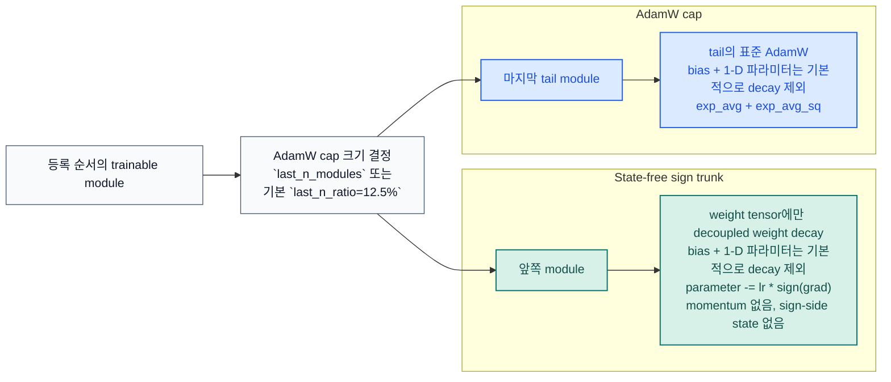

# stac-optimizer

[](https://pypi.org/project/stac-optimizer/)
[](https://www.python.org/downloads/release/python-3130/)
[](https://pytorch.org/)
[](https://github.com/smturtle2/stac-optimizer/actions/workflows/workflow.yml)

[English README](https://github.com/smturtle2/stac-optimizer/blob/main/README.md) |
[영문 문서](https://github.com/smturtle2/stac-optimizer/blob/main/docs/en/optimizer.md) |
[한국어 문서](https://github.com/smturtle2/stac-optimizer/blob/main/docs/ko/optimizer.md) |
[벤치마크 JSON](https://github.com/smturtle2/stac-optimizer/blob/main/docs/benchmark/research_benchmark.json)

STAC는 "SignSGD Trunk, AdamW Cap"의 약자입니다. sign trunk는 state-free로
유지하고, 마지막 trainable-module tail만 AdamW로 남겨 optimizer-state
VRAM을 줄이면서 tail 안정성을 지키는 것을 목표로 합니다.

| 항목 | 값 |
| --- | --- |
| Python | `>=3.13` |
| PyTorch | `>=2.10` |
| 기본 분할 | `last_n_ratio=0.125` |
| 명시적 override | `last_n_modules` |
| hybrid 모드 sign decay 기본값 | `0.5 * weight_decay` |
| 기본 no-decay 정책 | bias + 1-D 파라미터 |
| 권장 공개 ratio 인자 | `last_n_ratio` (`adamw_ratio`도 계속 지원) |

## 흐름



## 설치

```bash
python -m pip install stac-optimizer
```

개발 및 벤치마크 생성용 설치:

```bash
python -m pip install -e ".[dev]"
```

## 빠른 사용 예시

```python
import torch
from torch import nn

from stac_optimizer import STAC


model = nn.Sequential(
    nn.Linear(128, 64),
    nn.ReLU(),
    nn.Linear(64, 32),
    nn.ReLU(),
    nn.Linear(32, 10),
)

optimizer = STAC(
    model,
    lr=1e-3,
    last_n_ratio=0.125,
    weight_decay=1e-2,
    error_if_nonfinite=True,
)

loss = torch.nn.functional.mse_loss(
    model(torch.randn(8, 128)),
    torch.randn(8, 10),
)
loss.backward()
optimizer.step()
optimizer.zero_grad(set_to_none=True)
```

`last_n_ratio`는 trainable parameter를 직접 소유한 module만 셉니다.
`nn.Sequential` 같은 순수 컨테이너는 자기 자신이 parameter를 직접 갖지 않으면
자동으로 건너뜁니다. 정확한 cap 크기를 원하면 `last_n_modules`를 쓰면 됩니다.
Bias와 LayerNorm scale 같은 1-D 파라미터는 두 구간 모두에서 기본적으로
decoupled weight decay 대상에서 제외됩니다.

## CUDA 연구 스냅샷

이 저장소의 벤치마크는 CUDA 전용이며, held-out validation split,
`5`개 paired seed, seeded teacher, seeded student initialization, seed별
고정 batch schedule, 깊은 residual 모델, embedding과 LayerNorm이 들어간
transformer-like sequence task, 지원 시 BF16 autocast, epoch별 validation
loss curve, 첫 step optimizer-memory probe를 사용합니다.
AdamW baseline도 같은 bias/1-D no-decay 그룹핑을 사용해서 weight decay
정책 차이가 비교를 왜곡하지 않도록 했습니다.


`2026-03-19`, `torch 2.10.0+cu126`, `NVIDIA GeForce RTX 3070` 스냅샷:

| 설정 | 구성 | Deep regression val loss | Deep classification val acc | TailNorm val acc | Sequence val acc | Optimizer state MB | Peak step delta MB |
| --- | --- | ---: | ---: | ---: | ---: | ---: | ---: |
| `STAC default` | `last_n_ratio=0.125`, hybrid 기본 sign decay, bias/1-D no-decay | `0.015066` | `0.7006` | `0.7984` | `0.6909` | `8.133` | `16.125` |
| `STAC full-decay trunk` | `last_n_ratio=0.125`, `sign_weight_decay=weight_decay`, bias/1-D no-decay | `0.015075` | `0.6994` | `0.8064` | `0.7089` | `8.133` | `16.125` |
| `STAC wider cap` | `last_n_ratio=0.25`, bias/1-D no-decay | `0.014726` | `0.6943` | `0.7996` | `0.6909` | `24.149` | `36.125` |
| `AdamW baseline` | 실제로는 같은 no-decay 정책을 쓰는 full AdamW | `0.013574` | `0.7129` | `0.8268` | `0.7190` | `98.227` | `147.188` |

이 저장소 기준 해석으로는 기본 preset이 optimizer state를 `98.227 MB`에서
`8.133 MB`로 줄였고, full-decay variant는 같은 메모리에서 norm-heavy/sequence
태스크를 약간 돕고, wider cap은 더 많은 AdamW state를 써서 회귀 성능을
끌어올립니다. 이 수치는 저장소 내부 측정값이지 보편적 보장은 아닙니다.

## 검증

```bash
python -m pytest -q
python examples/research_benchmark.py --device cuda
rm -rf build dist
python -m build
python -m twine check dist/*
```
