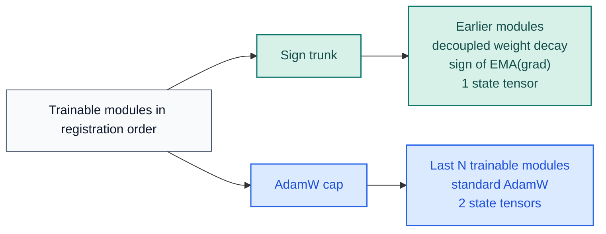

# stac-optimizer

[](https://pypi.org/project/stac-optimizer/)
[](https://www.python.org/downloads/release/python-3130/)
[](https://pytorch.org/)
[](https://github.com/smturtle2/stac-optimizer/actions/workflows/workflow.yml)

[Korean README](https://github.com/smturtle2/stac-optimizer/blob/main/README.ko.md) |
[Optimizer docs](https://github.com/smturtle2/stac-optimizer/blob/main/docs/en/optimizer.md) |
[Korean docs](https://github.com/smturtle2/stac-optimizer/blob/main/docs/ko/optimizer.md) |
[Benchmark JSON](https://github.com/smturtle2/stac-optimizer/blob/main/docs/benchmark/research_benchmark.json)

STAC keeps earlier trainable modules on momentum-stabilized sign updates and
the last `N` trainable modules on AdamW. The target is practical: lower
optimizer-state VRAM than full AdamW without giving up useful adaptivity on the
final trainable modules.

| Item | Value |
| --- | --- |
| Python | `>=3.13` |
| PyTorch | `>=2.10` |
| Default split | last `1` trainable module uses AdamW |
| Stability knobs | `sign_momentum`, `sign_lr_scale`, `error_if_nonfinite` |
| VRAM knob | `sign_state_dtype="auto"` or `"bf16"` |
| Partition inspection | `optimizer.partition.sign_module_names`, `optimizer.partition.adamw_module_names` |

## Layout



## Install

```bash
python -m pip install stac-optimizer
```

For local development:

```bash
python -m pip install -e ".[dev]"
```

## Quickstart

```python
import torch
from torch import nn

from stac_optimizer import STAC


model = nn.Sequential(
    nn.Linear(128, 64),
    nn.ReLU(),
    nn.Linear(64, 32),
    nn.ReLU(),
    nn.Linear(32, 10),
)

optimizer = STAC(
    model,
    lr=1e-3,
    last_n_modules=1,
    sign_momentum=0.9,
    weight_decay=1e-2,
    error_if_nonfinite=True,
)

loss = torch.nn.functional.mse_loss(
    model(torch.randn(8, 128)),
    torch.randn(8, 10),
)
loss.backward()
optimizer.step()
optimizer.zero_grad(set_to_none=True)

print(optimizer.partition.sign_module_names)
print(optimizer.partition.adamw_module_names)
```

`last_n_modules` counts only modules that directly own trainable parameters.
Pure containers such as `nn.Sequential` are skipped unless they own parameters
themselves.

`sign_state_dtype="auto"` is the default. Switch to `"bf16"` on CUDA when you
want a smaller sign-state footprint and the small precision trade-off is
acceptable for your workload.

## CUDA Benchmark

The repository benchmark uses separate train/validation splits, `5` paired
seeds, per-trial model initialization matched across optimizers, epoch-by-epoch
validation loss curves, and a first-step CUDA memory probe.


Latest snapshot from `2026-03-19` on `torch 2.10.0+cu126` and
`NVIDIA GeForce RTX 3070`:

| Config | Regression val loss | Classification val loss | Classification val acc | Optimizer state MB |
| --- | ---: | ---: | ---: | ---: |
| `STAC` default (`last_n_modules=1`) | `0.045044` | `0.278679` | `0.9016` | `3.637` |
| `STAC` wider AdamW section (`last_n_modules=2`) | `0.044285` | `0.281579` | `0.9039` | `3.762` |
| `STAC` bf16 sign state | `0.045177` | `0.281705` | `0.9004` | `1.821` |
| `AdamW` baseline | `0.043068` | `0.280832` | `0.9055` | `7.270` |

In this run, the default STAC configuration used about half the optimizer state
of AdamW, and the BF16 sign-state variant reduced that state again with only a
small quality delta. Full methodology and all ablations live in the linked docs
and JSON report.

The figure also includes a LayerNorm-heavy classification stress task. Treat
`last_n_modules` as a tuning knob, not a universal constant.

## Verify

```bash
python -m pytest -q
python -m build
python -m twine check dist/*
python examples/research_benchmark.py --device cuda
```
