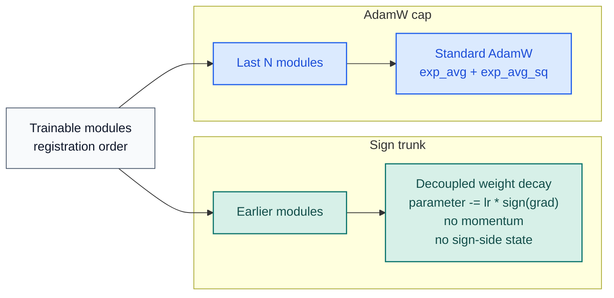

# stac-optimizer

[](https://pypi.org/project/stac-optimizer/)
[](https://www.python.org/downloads/release/python-3130/)
[](https://pytorch.org/)
[](https://github.com/smturtle2/stac-optimizer/actions/workflows/workflow.yml)

[Korean README](README.ko.md) |
[Optimizer docs](docs/en/optimizer.md) |
[Korean docs](docs/ko/optimizer.md) |
[Benchmark JSON](docs/benchmark/research_benchmark.json)

STAC means "SignSGD Trunk, AdamW Cap". The final `N` trainable modules use
AdamW, the earlier trainable modules use plain signSGD, and the sign trunk
keeps no optimizer state.

| Item | Value |
| --- | --- |
| Python | `>=3.13` |
| PyTorch | `>=2.10` |
| Default split | last `1` trainable module uses AdamW |
| Sign trunk | plain signSGD, no momentum, no sign-side state |
| Main tuning knobs | `last_n_modules`, `sign_weight_decay`, `sign_lr_scale`, `foreach` |
| First stability tweak | `sign_weight_decay = 0.5 * weight_decay` |

## Flow



## Install

```bash
python -m pip install stac-optimizer
```

For local development and benchmark generation:

```bash
python -m pip install -e ".[dev]"
```

## Quickstart

```python
import torch
from torch import nn

from stac_optimizer import STAC


model = nn.Sequential(
    nn.Linear(128, 64),
    nn.ReLU(),
    nn.Linear(64, 32),
    nn.ReLU(),
    nn.Linear(32, 10),
)

optimizer = STAC(
    model,
    lr=1e-3,
    last_n_modules=1,
    weight_decay=1e-2,
    sign_weight_decay=5e-3,  # repository benchmark: stronger first tuning point
    error_if_nonfinite=True,
)

loss = torch.nn.functional.mse_loss(
    model(torch.randn(8, 128)),
    torch.randn(8, 10),
)
loss.backward()
optimizer.step()
optimizer.zero_grad(set_to_none=True)
```

`last_n_modules` counts only modules that directly own trainable parameters.
Pure containers such as `nn.Sequential` are skipped unless they own parameters
themselves.

## CUDA Research Snapshot

The repository benchmark is CUDA-only and uses held-out validation splits,
`5` paired seeds, deep residual models, epoch-by-epoch validation loss curves,
and a first-step optimizer-memory probe.


Snapshot from `2026-03-19` on `torch 2.10.0+cu126` and
`NVIDIA GeForce RTX 3070`:

| Config | Setup | Deep regression val loss | Deep classification val acc | TailNorm val acc | Optimizer state MB | Peak step delta MB |
| --- | --- | ---: | ---: | ---: | ---: | ---: |
| `STAC default` | `last_n_modules=1` | `0.016294` | `0.7037` | `0.7926` | `0.125` | `7.001` |
| `STAC balanced trunk` | `last_n_modules=1`, `sign_weight_decay=0.5 * weight_decay` | `0.016114` | `0.7219` | `0.8027` | `0.125` | `7.001` |
| `STAC wider cap` | `last_n_modules=4`, `sign_weight_decay=0.5 * weight_decay` | `0.015287` | `0.7262` | `0.8029` | `24.149` | `32.153` |
| `AdamW baseline` | full AdamW | `0.013477` | `0.7207` | `0.8051` | `98.227` | `147.341` |

Repository finding: the balanced trunk improved classification and TailNorm
quality at the same optimizer-state cost as the default split, while the wider
cap improved regression and narrowed the quality gap further. That inference is
from this repository's benchmark, not a universal guarantee.

## Verify

```bash
python -m pytest -q
python examples/research_benchmark.py --device cuda
python -m build
python -m twine check dist/*
```
