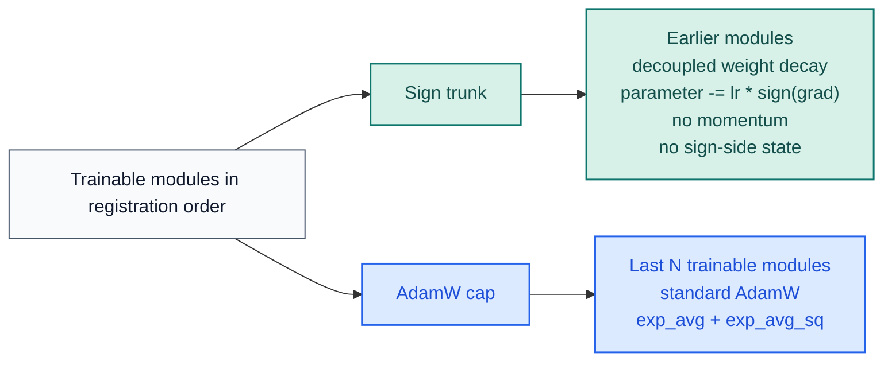
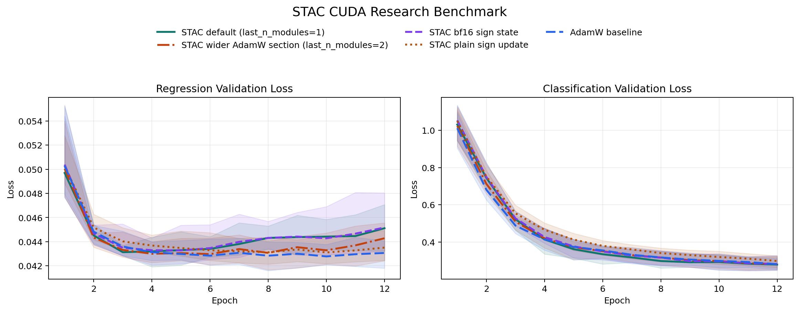

# stac-optimizer

[](https://pypi.org/project/stac-optimizer/)
[](https://www.python.org/downloads/release/python-3130/)
[](https://pytorch.org/)
[](https://github.com/smturtle2/stac-optimizer/actions/workflows/workflow.yml)

[Korean README](README.ko.md) |
[Optimizer docs](docs/en/optimizer.md) |
[Korean docs](docs/ko/optimizer.md) |
[Benchmark JSON](docs/benchmark/research_benchmark.json)

STAC keeps the last `N` trainable modules on AdamW and the earlier trainable
modules on plain signSGD. The sign trunk has no momentum and no sign-side
optimizer tensors, so optimizer-state VRAM stays far below full AdamW while
the tail remains adaptive.

| Item | Value |
| --- | --- |
| Python | `>=3.13` |
| PyTorch | `>=2.10` |
| Default split | last `1` trainable module uses AdamW |
| Sign trunk | plain signSGD, no momentum, no sign-side state |
| Main tuning knobs | `last_n_modules`, `sign_lr_scale`, `foreach` |
| Partition inspection | `optimizer.partition.sign_module_names`, `optimizer.partition.adamw_module_names` |

## Flow



## Install

```bash
python -m pip install stac-optimizer
```

For local development and benchmark generation:

```bash
python -m pip install -e ".[dev]"
```

## Quickstart

```python
import torch
from torch import nn

from stac_optimizer import STAC


model = nn.Sequential(
    nn.Linear(128, 64),
    nn.ReLU(),
    nn.Linear(64, 32),
    nn.ReLU(),
    nn.Linear(32, 10),
)

optimizer = STAC(
    model,
    lr=1e-3,
    last_n_modules=1,
    sign_lr_scale=1.0,
    weight_decay=1e-2,
    error_if_nonfinite=True,
)

loss = torch.nn.functional.mse_loss(
    model(torch.randn(8, 128)),
    torch.randn(8, 10),
)
loss.backward()
optimizer.step()
optimizer.zero_grad(set_to_none=True)

print(optimizer.partition.sign_module_names)
print(optimizer.partition.adamw_module_names)
```

`last_n_modules` counts only modules that directly own trainable parameters.
Pure containers such as `nn.Sequential` are skipped unless they own parameters
themselves.

## CUDA Benchmark

The repository benchmark uses held-out validation splits, `5` paired seeds,
deep residual models, epoch-by-epoch validation loss curves, and a first-step
CUDA memory probe.



Latest snapshot from `2026-03-19` on `torch 2.10.0+cu126` and
`NVIDIA GeForce RTX 3070`:

| Config | Deep regression val loss | Deep classification val acc | TailNorm val acc | Optimizer state MB | Peak delta MB |
| --- | ---: | ---: | ---: | ---: | ---: |
| `STAC` default (`last_n_modules=1`) | `0.016337` | `0.7037` | `0.7926` | `0.125` | `56.118` |
| `STAC` wider AdamW cap (`last_n_modules=4`) | `0.015252` | `0.7092` | `0.8041` | `24.149` | `81.271` |
| `AdamW` baseline | `0.013477` | `0.7207` | `0.8051` | `98.227` | `196.459` |

In this run, the default STAC configuration cut optimizer state from
`98.227 MB` to `0.125 MB` on the memory probe. A wider AdamW cap recovered
more quality on the harder tasks, but still used much less state than full
AdamW. Treat `last_n_modules` as a workload-dependent tuning knob.

## Verify

```bash
python -m pytest -q
python -m build
python -m twine check dist/*
python examples/research_benchmark.py --device cuda
```
