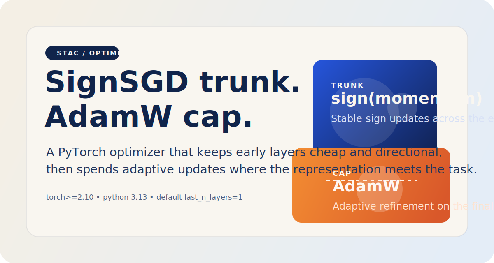
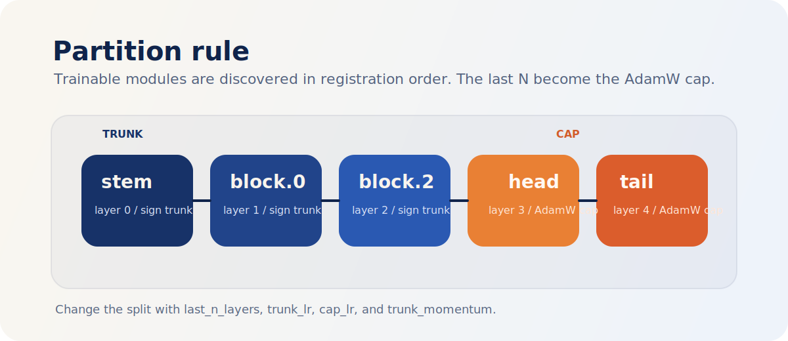
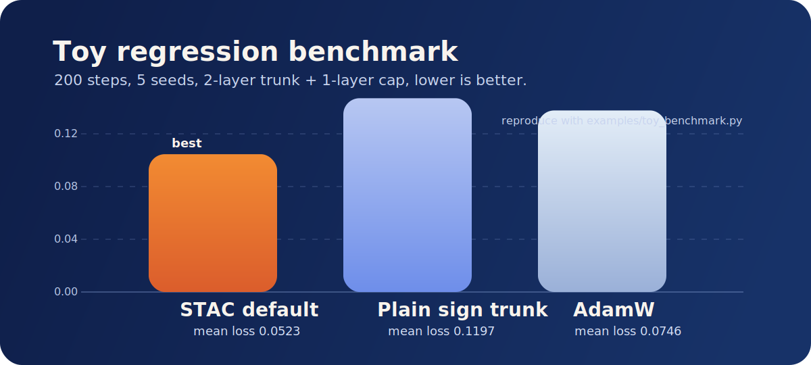

# stac-optimizer

<p align="center">
  
</p>

<p align="center">
  <a href="https://github.com/smturtle2/stac-optimizer/actions/workflows/workflow.yml">
    
  </a>
  
  
  
</p>

STAC stands for SignSGD Trunk, AdamW Cap.

It is a PyTorch optimizer that keeps most of the model on cheap sign-based
updates, then switches the last `N` trainable layers to AdamW. The default
trunk is not raw `sign(grad)`: it uses a momentum accumulator and applies
`sign(momentum)` because that is materially more stable in practice. If you
want textbook signSGD, set `trunk_momentum=0.0`.

## What It Does

- Walks `model.named_modules()` in deterministic registration order.
- Treats every module with direct trainable parameters as one layer.
- Sends the last `N` trainable layers to the AdamW cap.
- Keeps all earlier layers in the sign-based trunk.
- Supports role-specific learning rates and weight decay.
- Rejects sparse gradients and dynamic `add_param_group()` explicitly.

## Install

```bash
python -m pip install .
```

Development install:

```bash
python -m pip install -e ".[dev]"
```

## Quickstart

```python
import torch
from torch import nn

from stac_optimizer import STAC


model = nn.Sequential(
    nn.Linear(128, 64),
    nn.ReLU(),
    nn.Linear(64, 32),
    nn.ReLU(),
    nn.Linear(32, 10),
)

optimizer = STAC(
    model,
    lr=1e-3,
    last_n_layers=1,
    trunk_momentum=0.9,
    trunk_lr=8e-4,
    cap_lr=1e-3,
    weight_decay=1e-2,
    error_if_nonfinite=True,
)

inputs = torch.randn(8, 128)
targets = torch.randn(8, 10)

loss = torch.nn.functional.mse_loss(model(inputs), targets)
loss.backward()
optimizer.step()
optimizer.zero_grad(set_to_none=True)

print("trunk:", optimizer.partition.trunk_layer_names)
print("cap:", optimizer.partition.cap_layer_names)
```

## Partition Rule

<p align="center">
  
</p>

- Layer discovery uses `named_parameters(recurse=False)`.
- Frozen parameters are skipped when counting layers.
- Shared parameters are assigned to the first discovered owner.
- Root-level parameters are exposed as `"<root>"`.
- `last_n_layers=0` keeps the whole model in the trunk.
- Oversized `last_n_layers` moves the whole model into the cap.

## Hyperparameters

| Argument | Meaning |
| --- | --- |
| `lr` | Shared default learning rate. |
| `trunk_lr`, `cap_lr` | Role-specific learning rates. |
| `last_n_layers` | Number of final trainable layers that become AdamW. |
| `trunk_momentum` | EMA factor for the trunk before taking the sign. |
| `weight_decay` | Shared default decoupled weight decay. |
| `trunk_weight_decay`, `cap_weight_decay` | Role-specific decoupled weight decay. |
| `betas`, `eps` | AdamW cap hyperparameters. |
| `maximize` | Maximize instead of minimize. |
| `error_if_nonfinite` | Raise on `NaN` or `Inf` gradients. |

## Benchmark Snapshot

<p align="center">
  
</p>

These numbers come from [`examples/toy_benchmark.py`](examples/toy_benchmark.py)
on `Python 3.13.12` and `torch 2.10.0+cu126`.

| Optimizer | Mean final loss |
| --- | ---: |
| `STAC` default | `0.052278` |
| `STAC` with plain sign trunk | `0.119689` |
| `torch.optim.AdamW` | `0.074642` |

This is a sanity benchmark, not a universal claim. It does show the important
part: the default STAC configuration is not just API-correct, it is materially
better than a plain sign trunk on a real optimization loop.

## Constraints

- Sparse gradients are unsupported in both trunk and cap.
- `add_param_group()` is intentionally unsupported because STAC derives its
  parameter groups from model structure.
- The split follows module registration order, not dynamic forward order.

## Development

```bash
python -m pytest -q
python -m build
python examples/toy_benchmark.py
```

Current local verification:

- `python -m pytest -q` passed with `13` tests.
- `python -m build` produced sdist and wheel successfully.
- `python examples/toy_benchmark.py` reproduced the benchmark table above.

## Release

`.github/workflows/workflow.yml` runs tests, packages the project, validates the
built artifacts with `twine check`, and creates a GitHub Release for `v*` tags.

Typical flow:

```bash
git push origin main
git tag v0.1.1
git push origin v0.1.1
```

See [CHANGELOG.md](CHANGELOG.md) for change history.
