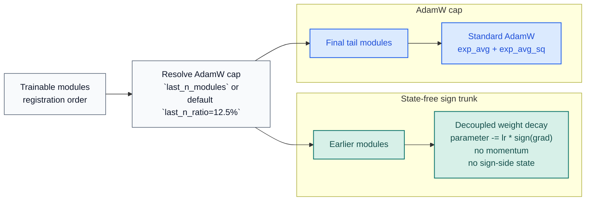

# stac-optimizer

[](https://pypi.org/project/stac-optimizer/)
[](https://www.python.org/downloads/release/python-3130/)
[](https://pytorch.org/)
[](https://github.com/smturtle2/stac-optimizer/actions/workflows/workflow.yml)

[Korean README](https://github.com/smturtle2/stac-optimizer/blob/main/README.ko.md) |
[Optimizer docs](https://github.com/smturtle2/stac-optimizer/blob/main/docs/en/optimizer.md) |
[Korean docs](https://github.com/smturtle2/stac-optimizer/blob/main/docs/ko/optimizer.md) |
[Benchmark JSON](https://github.com/smturtle2/stac-optimizer/blob/main/docs/benchmark/research_benchmark.json)

STAC means "SignSGD Trunk, AdamW Cap". It keeps the sign trunk state-free,
uses AdamW only on the final trainable-module tail, and is tuned to reduce
optimizer-state VRAM without giving up tail stability.

| Item | Value |
| --- | --- |
| Python | `>=3.13` |
| PyTorch | `>=2.10` |
| Default split | `last_n_ratio=0.125` |
| Explicit override | `last_n_modules` |
| Default sign decay in hybrid mode | `0.5 * weight_decay` |
| Preferred public ratio arg | `last_n_ratio` (`adamw_ratio` remains supported) |

## Flow



## Install

```bash
python -m pip install stac-optimizer
```

For local development and benchmark generation:

```bash
python -m pip install -e ".[dev]"
```

## Quickstart

```python
import torch
from torch import nn

from stac_optimizer import STAC


model = nn.Sequential(
    nn.Linear(128, 64),
    nn.ReLU(),
    nn.Linear(64, 32),
    nn.ReLU(),
    nn.Linear(32, 10),
)

optimizer = STAC(
    model,
    lr=1e-3,
    last_n_ratio=0.125,
    weight_decay=1e-2,
    error_if_nonfinite=True,
)

loss = torch.nn.functional.mse_loss(
    model(torch.randn(8, 128)),
    torch.randn(8, 10),
)
loss.backward()
optimizer.step()
optimizer.zero_grad(set_to_none=True)
```

`last_n_ratio` counts only modules that directly own trainable parameters.
Pure containers such as `nn.Sequential` are skipped unless they own parameters
themselves. Use `last_n_modules` when you want an explicit cap size instead.

## CUDA Research Snapshot

The repository benchmark is CUDA-only and uses held-out validation splits,
`5` paired seeds, seeded teachers, seeded student initialization, fixed batch
schedules per seed, deep residual models, epoch-by-epoch validation loss
curves, and a first-step optimizer-memory probe.


Snapshot from `2026-03-19` on `torch 2.10.0+cu126` and
`NVIDIA GeForce RTX 3070`:

| Config | Setup | Deep regression val loss | Deep classification val acc | TailNorm val acc | Optimizer state MB | Peak step delta MB |
| --- | --- | ---: | ---: | ---: | ---: | ---: |
| `STAC default` | `last_n_ratio=0.125`, hybrid default sign decay | `0.014963` | `0.6996` | `0.8037` | `8.133` | `16.134` |
| `STAC full-decay trunk` | `last_n_ratio=0.125`, `sign_weight_decay=weight_decay` | `0.015065` | `0.7021` | `0.8092` | `8.133` | `16.134` |
| `STAC wider cap` | `last_n_ratio=0.25` | `0.014767` | `0.6916` | `0.8035` | `24.149` | `32.153` |
| `AdamW baseline` | full AdamW | `0.013574` | `0.7133` | `0.8266` | `98.227` | `147.341` |

Repository takeaway: the default preset cuts optimizer state from
`98.227 MB` to `8.133 MB`, the full-decay variant changes only the trunk decay
rule at the same memory cost, and the wider cap spends more AdamW state to
improve regression. Those are repository-local measurements, not universal
guarantees.

## Verify

```bash
python -m pytest -q
python examples/research_benchmark.py --device cuda
rm -rf build dist
python -m build
python -m twine check dist/*
```
