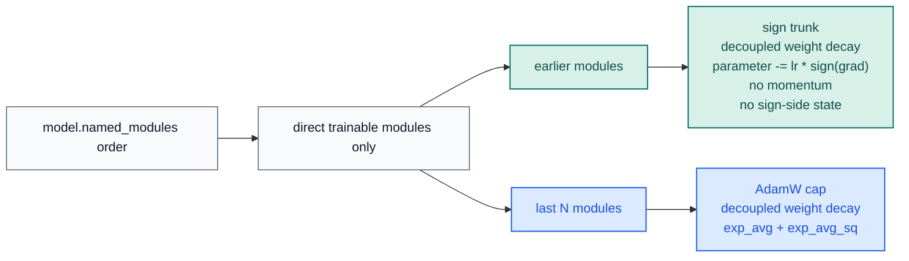

# STAC Optimizer Docs

[README](../../README.md) |
[Korean docs](../ko/optimizer.md) |
[Benchmark JSON](../benchmark/research_benchmark.json)

STAC means "SignSGD Trunk, AdamW Cap". It keeps the final `N` trainable
modules on AdamW and the earlier trainable modules on plain signSGD. The sign
trunk is intentionally momentum-free and sign-state-free.

## Update Rules

| Section | Modules | Rule | Optimizer state |
| --- | --- | --- | --- |
| Sign trunk | all trainable modules before the last `N` | decoupled weight decay, then `parameter -= lr * sign(grad)` | none |
| AdamW cap | last `N` trainable modules | standard AdamW | `exp_avg` + `exp_avg_sq` (+ AMSGrad max if enabled) |

STAC counts only modules that directly own trainable parameters
(`named_parameters(recurse=False)`). Pure containers such as `nn.Sequential`
are skipped unless they own parameters themselves.

When both sections are active, STAC uses `sign_lr_scale * lr` for the sign
trunk and `lr` for the AdamW cap. The default `sign_lr_scale=1.0` keeps the
public learning rate interpretation simple, but lowering it is often useful
when the sign trunk is too aggressive for a workload.

## Why This Design

Research constraints pull in two directions:

- The original signSGD paper introduced sign-only updates and reported that a
  momentum counterpart could match Adam on large image models. STAC does not
  use that momentum path because this library is explicitly scoped to plain
  signSGD in the trunk.
- The error-feedback paper showed that plain signSGD can fail to converge or
  generalize poorly in some settings. That is a real limitation, not something
  to hide.
- The ICLR 2025 optimizer study found that adaptivity on the last layer and
  LayerNorm parameters matters disproportionately for performance and learning
  rate stability.

STAC is the practical compromise derived from those sources and from this
repository's CUDA benchmarks: keep the trunk on textbook signSGD, but preserve
AdamW where adaptivity is most likely to matter. The claim that widening the
AdamW cap helps normalization-heavy tails is an inference from the cited paper
and from the benchmark results in this repository.

## Stability Notes

| Knob | Default | When to change it |
| --- | --- | --- |
| `last_n_modules` | `1` | Increase it when the final normalization and head both need adaptivity |
| `sign_lr_scale` | `1.0` | Lower it when the sign trunk is too noisy or overshoots |
| `foreach` | `False` | Enable only when step throughput matters more than peak memory |
| `error_if_nonfinite` | `False` | Turn on when you want immediate failure on `NaN` or `Inf` gradients |

`foreach=False` is deliberate. PyTorch's AdamW docs note that the foreach path
typically runs faster on CUDA, but it also uses roughly `sizeof(params)` more
peak memory because intermediates are materialized as tensor lists.

## Public API

| Symbol | Purpose |
| --- | --- |
| `STAC` | Hybrid optimizer |
| `partition_trainable_modules(model, last_n_modules=1)` | Deterministically split trainable modules into sign and AdamW sections |
| `ModuleGroup` | One direct-owning trainable module slice |
| `STACPartition` | Named view over the resulting sign/AdamW split |

Runtime guarantees that matter in practice:

- deterministic partitioning from `model.named_modules()`
- explicit sparse-gradient rejection
- no sign-side optimizer state in the sign trunk
- whole-step skip on non-finite dense gradients unless `error_if_nonfinite=True`
- state-dict validation for roles, module names, parameter names, and tensor shapes
- AdamW step counters kept on CPU in non-capturable mode to avoid unnecessary CUDA state

## Benchmark Evidence

Primary assets:

- [Benchmark script](../../examples/research_benchmark.py)
- [JSON report](../benchmark/research_benchmark.json)
- [Loss-curve PNG](../benchmark/research_benchmark.png)

Snapshot from `2026-03-19` on `torch 2.10.0+cu126` and
`NVIDIA GeForce RTX 3070`:

| Config | Deep regression val loss | Deep classification val acc | TailNorm val acc | Optimizer state MB | Peak delta MB |
| --- | ---: | ---: | ---: | ---: | ---: |
| `STAC` default (`last_n_modules=1`) | `0.016337` | `0.7037` | `0.7926` | `0.125` | `56.118` |
| `STAC` wider AdamW cap (`last_n_modules=4`) | `0.015252` | `0.7092` | `0.8041` | `24.149` | `81.271` |
| `AdamW` baseline | `0.013477` | `0.7207` | `0.8051` | `98.227` | `196.459` |

Methodology used by the repository benchmark:

- CUDA only
- held-out validation splits
- `5` paired seeds
- deep residual models instead of shallow MLPs
- epoch-by-epoch validation loss curves
- optimizer-state and peak CUDA memory probe on the first optimization step

## References

- [signSGD: Compressed Optimisation for Non-Convex Problems](https://arxiv.org/abs/1802.04434)
- [Error Feedback Fixes SignSGD and other Gradient Compression Schemes](https://proceedings.mlr.press/v97/karimireddy19a.html)
- [Momentum Ensures Convergence of SIGNSGD under Weaker Assumptions](https://proceedings.mlr.press/v202/sun23l.html)
- [Decoupled Weight Decay Regularization](https://arxiv.org/abs/1711.05101)
- [Deconstructing What Makes a Good Optimizer for Autoregressive Language Models](https://openreview.net/forum?id=zfeso8ceqr)
- [PyTorch AdamW documentation](https://docs.pytorch.org/docs/stable/generated/torch.optim.AdamW.html)
