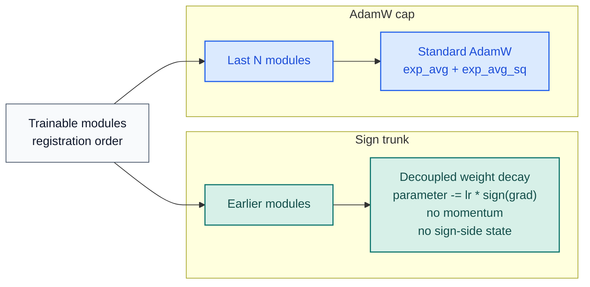

# STAC Optimizer Docs

[README](../../README.md) |
[Korean docs](../ko/optimizer.md) |
[Benchmark JSON](../benchmark/research_benchmark.json)

STAC means "SignSGD Trunk, AdamW Cap". The final `N` trainable modules stay on
AdamW and the earlier trainable modules use plain signSGD. The sign trunk is
deliberately state-free: no momentum, no EMA, and no sign-side optimizer
tensors.

## Update Rules

| Section | Modules | Rule | Optimizer state |
| --- | --- | --- | --- |
| Sign trunk | all trainable modules before the last `N` | decoupled weight decay, then `parameter -= lr * sign(grad)` | none |
| AdamW cap | last `N` trainable modules | standard AdamW | `exp_avg` + `exp_avg_sq` (+ AMSGrad max if enabled) |

STAC counts only modules that directly own trainable parameters
(`named_parameters(recurse=False)`). Pure containers such as `nn.Sequential`
are skipped unless they own parameters themselves.

## Why This Split Exists

The research picture is mixed:

- The original signSGD paper introduced sign-only updates and reported strong
  large-scale results.
- The error-feedback paper showed that plain signSGD can fail to converge or
  generalize poorly in some settings.
- The ICLR 2025 optimizer study found that adaptivity on the last layer and
  LayerNorm parameters matters disproportionately for performance and learning
  rate stability.

STAC is the constrained compromise for that evidence: keep the trunk on plain
signSGD to avoid sign-side state, but preserve AdamW on the tail where
adaptivity matters most.

## Stability Playbook

| Knob | Default | Practical use |
| --- | --- | --- |
| `last_n_modules` | `1` | Increase it when the adaptive tail is too small for the workload |
| `sign_weight_decay` | inherits `weight_decay` | First tuning step for classification-heavy workloads; `0.5 * weight_decay` worked well in this repository benchmark |
| `sign_lr_scale` | `1.0` | Lower it when the sign trunk is too aggressive or noisy |
| `foreach` | `False` | Turn on only when step throughput matters more than peak memory |
| `error_if_nonfinite` | `False` | Turn on when `NaN` or `Inf` gradients should fail immediately |

The `sign_weight_decay = 0.5 * weight_decay` recommendation above is an
inference from this repository's benchmark, not a universal rule.

`foreach=False` is deliberate. PyTorch's AdamW docs note that the foreach path
is often faster on CUDA, but it also uses about `sizeof(params)` more peak
memory because the intermediates are materialized as tensor lists.

## Public API

| Symbol | Purpose |
| --- | --- |
| `STAC` | Hybrid optimizer |
| `partition_trainable_modules(model, last_n_modules=1)` | Deterministically split trainable modules into sign and AdamW sections |
| `ModuleGroup` | One direct-owning trainable module slice |
| `STACPartition` | Named view over the resulting sign/AdamW split |

Runtime guarantees that matter in practice:

- deterministic partitioning from `model.named_modules()`
- no sign-side optimizer state in the sign trunk
- explicit sparse-gradient rejection
- whole-step skip on non-finite dense gradients unless `error_if_nonfinite=True`
- state-dict validation for roles, module names, parameter names, and tensor shapes
- AdamW step counters kept on CPU in non-capturable mode to avoid unnecessary CUDA state

## Benchmark Evidence

Primary assets:

- [Benchmark script](../../examples/research_benchmark.py)
- [JSON report](../benchmark/research_benchmark.json)
- [Loss-curve PNG](../benchmark/research_benchmark.png)

Snapshot from `2026-03-19` on `torch 2.10.0+cu126` and
`NVIDIA GeForce RTX 3070`:

| Config | Setup | Deep regression val loss | Deep classification val acc | TailNorm val acc | Optimizer state MB | Peak step delta MB |
| --- | --- | ---: | ---: | ---: | ---: | ---: |
| `STAC default` | `last_n_modules=1` | `0.016294` | `0.7037` | `0.7926` | `0.125` | `7.001` |
| `STAC balanced trunk` | `last_n_modules=1`, `sign_weight_decay=0.5 * weight_decay` | `0.016114` | `0.7219` | `0.8027` | `0.125` | `7.001` |
| `STAC wider cap` | `last_n_modules=4`, `sign_weight_decay=0.5 * weight_decay` | `0.015287` | `0.7262` | `0.8029` | `24.149` | `32.153` |
| `AdamW baseline` | full AdamW | `0.013477` | `0.7207` | `0.8051` | `98.227` | `147.341` |

Methodology used by the repository benchmark:

- CUDA only
- held-out validation splits
- `5` paired seeds
- deep residual models instead of shallow toy MLPs
- epoch-by-epoch validation loss curves
- optimizer-state and peak step-memory probe on the first optimization step

Repository takeaway: the balanced trunk recovered most of the classification gap
at the same optimizer-state cost as the default split, while the wider cap
traded more AdamW state for better regression and tail quality. That is an
inference from this repository's benchmark, not a universal claim.

## References

- [signSGD: Compressed Optimisation for Non-Convex Problems](https://arxiv.org/abs/1802.04434)
- [Error Feedback Fixes SignSGD and other Gradient Compression Schemes](https://proceedings.mlr.press/v97/karimireddy19a.html)
- [Decoupled Weight Decay Regularization](https://arxiv.org/abs/1711.05101)
- [Deconstructing What Makes a Good Optimizer for Autoregressive Language Models](https://openreview.net/forum?id=zfeso8ceqr)
- [PyTorch AdamW documentation](https://docs.pytorch.org/docs/stable/generated/torch.optim.AdamW.html)
