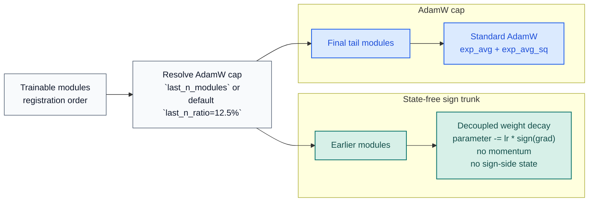

# STAC Optimizer Docs

[README](../../README.md) |
[Korean docs](../ko/optimizer.md) |
[Benchmark JSON](../benchmark/research_benchmark.json)

STAC means "SignSGD Trunk, AdamW Cap". It keeps the sign trunk state-free,
moves only the final trainable-module tail to AdamW, and defaults to a
ratio-based tail instead of a fixed single module.

## Update Rules

| Section | Modules | Rule | Optimizer state |
| --- | --- | --- | --- |
| Sign trunk | all counted trainable modules before the AdamW cap | decoupled weight decay, then `parameter -= lr * sign(grad)` | none |
| AdamW cap | final trainable-module tail | standard AdamW | `exp_avg` + `exp_avg_sq` (+ AMSGrad max if enabled) |

STAC counts only modules that directly own trainable parameters
(`named_parameters(recurse=False)`). Pure containers such as `nn.Sequential`
are skipped unless they own parameters themselves.

## Defaults

| Knob | Default | Notes |
| --- | --- | --- |
| `last_n_ratio` | `0.125` | preferred public ratio argument |
| `last_n_modules` | `None` | explicit count override for the tail |
| `sign_weight_decay` | `0.5 * weight_decay` in hybrid mode | keeps the sign trunk slightly less aggressive by default |
| `sign_lr_scale` | `1.0` | lower it when the sign trunk is too noisy |
| `foreach` | `False` | more VRAM conservative than the foreach path |
| `error_if_nonfinite` | `False` | skips the full step on non-finite dense gradients |

`adamw_ratio` is still accepted as a backward-compatible alias for
`last_n_ratio`.

## Public API

| Symbol | Purpose |
| --- | --- |
| `STAC` | Hybrid optimizer |
| `partition_trainable_modules(model, last_n_ratio=0.125, last_n_modules=None)` | Deterministically split trainable modules into sign and AdamW sections |
| `resolve_adamw_cap_module_count(total_trainable_modules, ...)` | Resolve the final AdamW-cap size from a ratio or explicit count |
| `ModuleGroup` | One direct-owning trainable module slice |
| `STACPartition` | Named view over the resulting sign/AdamW split |

Runtime guarantees that matter in practice:

- deterministic partitioning from `model.named_modules()`
- no sign-side optimizer state in the sign trunk
- explicit sparse-gradient rejection
- whole-step skip on non-finite dense gradients unless `error_if_nonfinite=True`
- state-dict validation for roles, module names, parameter names, and tensor shapes
- AdamW step counters kept on CPU in non-capturable mode to avoid unnecessary CUDA state

## Why This Split Exists

The research picture is mixed:

- the original signSGD paper reported strong large-scale results for sign-only updates
- error-feedback work showed that plain signSGD can fail in some settings
- the ICLR 2025 optimizer study argues that last-layer and normalization adaptivity matter disproportionately

STAC is the constrained compromise for that evidence: keep the trunk on plain
signSGD to avoid sign-side state, but preserve AdamW on the tail where
adaptivity often matters most.

## Benchmark Evidence

Primary assets:

- [Benchmark script](../../examples/research_benchmark.py)
- [JSON report](../benchmark/research_benchmark.json)
- [Loss-curve PNG](../benchmark/research_benchmark.png)

Snapshot from `2026-03-19` on `torch 2.10.0+cu126` and
`NVIDIA GeForce RTX 3070`:

| Config | Setup | Deep regression val loss | Deep classification val acc | TailNorm val acc | Optimizer state MB | Peak step delta MB |
| --- | --- | ---: | ---: | ---: | ---: | ---: |
| `STAC default` | `last_n_ratio=0.125`, hybrid default sign decay | `0.014963` | `0.6996` | `0.8037` | `8.133` | `16.134` |
| `STAC full-decay trunk` | `last_n_ratio=0.125`, `sign_weight_decay=weight_decay` | `0.015065` | `0.7021` | `0.8092` | `8.133` | `16.134` |
| `STAC wider cap` | `last_n_ratio=0.25` | `0.014767` | `0.6916` | `0.8035` | `24.149` | `32.153` |
| `AdamW baseline` | full AdamW | `0.013574` | `0.7133` | `0.8266` | `98.227` | `147.341` |

Methodology used by the repository benchmark:

- CUDA only
- held-out validation splits
- `5` paired seeds
- seeded teachers, seeded student initialization, and fixed batch schedules per seed
- deep residual models instead of shallow toy MLPs
- epoch-by-epoch validation loss curves
- optimizer-state and peak step-memory probe on the first optimization step

Repository takeaway: the default preset cuts optimizer state from `98.227 MB`
to `8.133 MB`, the full-decay variant isolates the trunk decay choice at the
same memory cost, and the wider cap trades more AdamW state for better
regression. That is repository-local evidence, not a universal claim.

## References

- [signSGD: Compressed Optimisation for Non-Convex Problems](https://arxiv.org/abs/1802.04434)
- [Error Feedback Fixes SignSGD and other Gradient Compression Schemes](https://proceedings.mlr.press/v97/karimireddy19a.html)
- [Decoupled Weight Decay Regularization](https://arxiv.org/abs/1711.05101)
- [Deconstructing What Makes a Good Optimizer for Autoregressive Language Models](https://openreview.net/forum?id=zfeso8ceqr)
- [PyTorch AdamW documentation](https://docs.pytorch.org/docs/stable/generated/torch.optim.AdamW.html)
