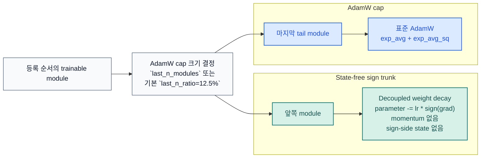

# STAC 옵티마이저 문서

[README](../../README.ko.md) |
[영문 문서](../en/optimizer.md) |
[벤치마크 JSON](../benchmark/research_benchmark.json)

STAC는 "SignSGD Trunk, AdamW Cap"의 약자입니다. sign trunk는 state-free로
유지하고, 마지막 trainable-module tail만 AdamW로 보내며, 기본값도 고정된
단일 module이 아니라 ratio 기반 tail을 사용합니다.

## 업데이트 규칙

| 구간 | 대상 module | 규칙 | 옵티마이저 state |
| --- | --- | --- | --- |
| Sign trunk | AdamW cap 이전의 모든 counted trainable module | decoupled weight decay 후 `parameter -= lr * sign(grad)` | 없음 |
| AdamW cap | 마지막 trainable-module tail | 표준 AdamW | `exp_avg` + `exp_avg_sq` (+ AMSGrad max) |

STAC는 `named_parameters(recurse=False)` 기준으로 직접 trainable parameter를
소유한 module만 셉니다. `nn.Sequential` 같은 순수 컨테이너는 자기 자신이
parameter를 갖지 않으면 자동으로 건너뜁니다.

## 기본값

| 조절값 | 기본값 | 설명 |
| --- | --- | --- |
| `last_n_ratio` | `0.125` | 권장 공개 ratio 인자 |
| `last_n_modules` | `None` | tail 크기를 명시적으로 override |
| `sign_weight_decay` | hybrid 모드에서 `0.5 * weight_decay` | 기본적으로 sign trunk를 조금 덜 공격적으로 둠 |
| `sign_lr_scale` | `1.0` | sign trunk가 noisy하면 낮춤 |
| `foreach` | `False` | foreach 경로보다 VRAM 보수적 |
| `error_if_nonfinite` | `False` | non-finite dense gradient에서 step 전체 skip |

`adamw_ratio`는 `last_n_ratio`의 하위 호환 alias로 계속 지원됩니다.

## 공개 API

| 심볼 | 역할 |
| --- | --- |
| `STAC` | 하이브리드 옵티마이저 |
| `partition_trainable_modules(model, last_n_ratio=0.125, last_n_modules=None)` | trainable module을 sign/AdamW 구간으로 결정적으로 분할 |
| `resolve_adamw_cap_module_count(total_trainable_modules, ...)` | ratio 또는 명시적 count로 AdamW cap 크기를 계산 |
| `ModuleGroup` | 직접 소유 파라미터 기준의 단일 trainable module slice |
| `STACPartition` | sign/AdamW 분할 결과를 이름으로 조회하는 구조체 |

실사용에서 중요한 보장:

- `model.named_modules()` 기반의 결정적 분할
- sign trunk에서 sign-side optimizer state 없음
- sparse gradient 명시적 거부
- `error_if_nonfinite=False`일 때 non-finite dense gradient step 전체 skip
- state dict 로드 시 역할, 모듈 이름, 파라미터 이름, state shape 검증
- non-capturable 모드에서 AdamW step counter를 CPU에 두어 불필요한 CUDA state 방지

## 왜 이런 분할인가

연구 결과는 한쪽으로만 정리되지 않습니다.

- 원래 signSGD 논문은 sign-only 업데이트에서 강한 대규모 결과를 보고했습니다
- error-feedback 연구는 plain signSGD가 특정 조건에서 실패할 수 있음을 보였습니다
- ICLR 2025 optimizer 연구는 마지막 layer와 normalization 쪽 adaptivity가 특히 중요하다고 설명합니다

STAC는 이 근거들을 동시에 만족시키려는 절충안입니다. trunk는 plain
signSGD로 유지해 sign-side state를 없애고, adaptivity가 중요한 tail만
AdamW로 남깁니다.

## 벤치마크 근거

주요 자료:

- [벤치마크 스크립트](../../examples/research_benchmark.py)
- [JSON 결과](../benchmark/research_benchmark.json)
- [loss curve PNG](../benchmark/research_benchmark.png)

`2026-03-19`, `torch 2.10.0+cu126`, `NVIDIA GeForce RTX 3070` 스냅샷:

| 설정 | 구성 | Deep regression val loss | Deep classification val acc | TailNorm val acc | Optimizer state MB | Peak step delta MB |
| --- | --- | ---: | ---: | ---: | ---: | ---: |
| `STAC default` | `last_n_ratio=0.125`, hybrid 기본 sign decay | `0.014963` | `0.6996` | `0.8037` | `8.133` | `16.134` |
| `STAC full-decay trunk` | `last_n_ratio=0.125`, `sign_weight_decay=weight_decay` | `0.015065` | `0.7021` | `0.8092` | `8.133` | `16.134` |
| `STAC wider cap` | `last_n_ratio=0.25` | `0.014767` | `0.6916` | `0.8035` | `24.149` | `32.153` |
| `AdamW baseline` | full AdamW | `0.013574` | `0.7133` | `0.8266` | `98.227` | `147.341` |

이 저장소 벤치마크 방법론:

- CUDA 전용
- held-out validation split
- `5`개 paired seed
- seeded teacher, seeded student initialization, seed별 고정 batch schedule
- shallow toy MLP 대신 깊은 residual 모델 사용
- epoch별 validation loss curve 기록
- 첫 optimization step에서 optimizer-state와 peak step-memory probe 측정

이 저장소 기준 해석으로는 기본 preset이 optimizer state를 `98.227 MB`에서
`8.133 MB`로 줄였고, full-decay variant는 같은 메모리에서 trunk decay 선택만
분리해서 비교하며, wider cap은 더 많은 AdamW state를 써서 회귀 성능을
끌어올립니다. 이 수치는 저장소 내부 근거이지 보편적 보장은 아닙니다.

## 참고 문헌

- [signSGD: Compressed Optimisation for Non-Convex Problems](https://arxiv.org/abs/1802.04434)
- [Error Feedback Fixes SignSGD and other Gradient Compression Schemes](https://proceedings.mlr.press/v97/karimireddy19a.html)
- [Decoupled Weight Decay Regularization](https://arxiv.org/abs/1711.05101)
- [Deconstructing What Makes a Good Optimizer for Autoregressive Language Models](https://openreview.net/forum?id=zfeso8ceqr)
- [PyTorch AdamW documentation](https://docs.pytorch.org/docs/stable/generated/torch.optim.AdamW.html)
