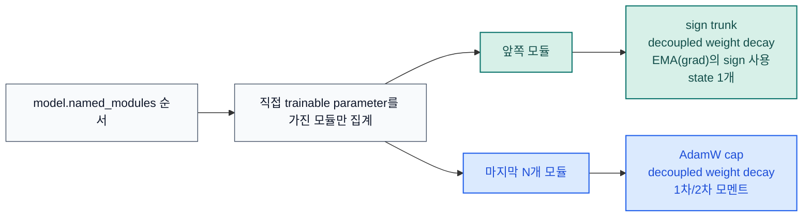

# STAC 옵티마이저 문서

[README](https://github.com/smturtle2/stac-optimizer/blob/main/README.ko.md) |
[영문 문서](https://github.com/smturtle2/stac-optimizer/blob/main/docs/en/optimizer.md)

STAC는 "SignSGD Trunk, AdamW Cap"의 약자입니다. 앞쪽 학습 모듈은
momentum-stabilized sign 업데이트로, 마지막 `N`개 학습 모듈은 AdamW로
유지합니다. 목표는 단순합니다. 전체 AdamW보다 optimizer state VRAM을
줄이되, adaptivity가 중요한 구간의 최적화 성능은 최대한 유지하는 것입니다.

## 구조



STAC는 `named_parameters(recurse=False)` 기준으로 직접 trainable parameter를
소유한 모듈만 셉니다. `nn.Sequential` 같은 순수 컨테이너는 자기 자신이
parameter를 가지지 않으면 자동으로 건너뜁니다.

## 업데이트 규칙

| 구간 | 대상 모듈 | 규칙 | 옵티마이저 state |
| --- | --- | --- | --- |
| Sign trunk | 마지막 `N`개 이전의 모든 학습 모듈 | decoupled weight decay 후 `sign(EMA(grad))` | 파라미터당 momentum buffer 1개 |
| AdamW cap | 마지막 `N`개 학습 모듈 | 표준 AdamW | `exp_avg` + `exp_avg_sq` (+ AMSGrad max) |

두 구간이 모두 활성화되면 sign trunk는 `sign_lr_scale * lr`, AdamW cap은 `lr`
를 사용합니다. 기본값 `sign_lr_scale=0.75`는 이 저장소의 CUDA 연구용
벤치마크에서 무난한 안정성을 보인 보수적 설정입니다.

## 안정성/메모리 조절 포인트

| 인자 | 기본값 | 의미 |
| --- | --- | --- |
| `last_n_modules` | `1` | 기본적으로 마지막 핵심 모듈은 AdamW로 유지 |
| `sign_momentum` | `0.9` | raw sign보다 momentum 뒤 sign이 더 안정적 |
| `sign_lr_scale` | `0.75` | hybrid 모드에서 sign 구간을 조금 더 보수적으로 운용 |
| `sign_state_dtype` | `"auto"` | FP16/BF16 파라미터는 기본적으로 FP32 sign state 사용, 필요하면 BF16으로 더 절약 가능 |
| `foreach` | `False` | 기본적으로 peak CUDA memory를 낮게 유지, step 처리량이 더 중요할 때만 opt-in |
| `error_if_nonfinite` | `False` | `NaN`/`Inf` gradient에서 즉시 예외 또는 step 전체 skip |

`sign_state_dtype="auto"`의 동작:

- FP16/BF16 파라미터는 sign momentum state를 FP32로 둡니다.
- FP32/FP64 파라미터는 파라미터 dtype을 그대로 따릅니다.
- `None` 또는 `"parameter"`를 주면 항상 파라미터 dtype을 그대로 맞춥니다.

`foreach=False`를 기본값으로 둔 이유도 같습니다. PyTorch 문서상 foreach
경로는 CUDA에서 더 빠를 수 있지만, 중간 tensor list 때문에 peak memory를 더
사용할 수 있습니다. STAC는 기본적으로 메모리 절약 쪽을 택하고, 필요할 때만
사용자가 명시적으로 켜도록 했습니다.

## 추천 프리셋

| 목표 | 추천 설정 |
| --- | --- |
| 기본 안정성 | `STAC(model, last_n_modules=1, sign_state_dtype="auto")` |
| 더 낮은 VRAM | `STAC(model, last_n_modules=1, sign_state_dtype="bf16")` |
| 더 넓은 adaptive tail | `STAC(model, last_n_modules=2, sign_state_dtype="auto")` |

이 저장소의 CUDA 테스트는 기본 프리셋, BF16 sign-state 변형, 그리고
LayerNorm 비중이 있는 분류 태스크까지 포함해 단순 MLP head 쪽으로만
치우치지 않도록 구성했습니다.

## `last_n_modules` 선택 가이드

- `1`: 작은 MLP/CNN head 위주 모델의 기본값으로 적절합니다.
- `2`: 마지막 normalization과 head를 함께 AdamW로 두고 싶을 때 좋은 출발점입니다.
- 이 저장소의 LayerNorm-heavy CUDA stress task에서는 `2`보다 더 큰 cap이
  추가로 도움이 됐으므로, `2`를 보편 상수처럼 쓰기보다
  `optimizer.partition`을 보고 판단하는 편이 안전합니다.
- transformer 계열은 `optimizer.partition`으로 마지막 norm/head가 AdamW cap에
  실제로 들어갔는지 확인하는 편이 안전합니다.

이 방향은 ICLR 2025 optimizer 연구에서 마지막 layer와 LayerNorm의 adaptivity가
성능과 학습률 안정성 유지에 특히 중요하다고 본 결과와도 맞닿아 있습니다.

```python
optimizer = STAC(model, last_n_modules=2)
print(optimizer.partition.sign_module_names)
print(optimizer.partition.adamw_module_names)
```

## 공개 API

| 심볼 | 역할 |
| --- | --- |
| `STAC` | 하이브리드 옵티마이저 본체 |
| `partition_trainable_modules(model, last_n_modules=1)` | trainable module을 sign/AdamW 구간으로 결정적으로 분할 |
| `ModuleGroup` | 직접 소유 파라미터 기준의 단일 trainable module slice |
| `STACPartition` | sign/AdamW 분할 결과를 이름으로 조회하는 구조체 |

실사용에서 중요한 보장:

- `model.named_modules()` 기반의 결정적 분할
- sparse gradient 명시적 거부
- `error_if_nonfinite=False`일 때 non-finite dense gradient step 전체 skip
- state dict 로드 시 역할, 모듈 이름, 파라미터 이름, state shape 검증

## 벤치마크 근거

주요 자료:

- [벤치마크 스크립트](https://github.com/smturtle2/stac-optimizer/blob/main/examples/research_benchmark.py)
- [JSON 결과](https://github.com/smturtle2/stac-optimizer/blob/main/docs/benchmark/research_benchmark.json)
- [loss curve PNG](https://github.com/smturtle2/stac-optimizer/blob/main/docs/benchmark/research_benchmark.png)

이 저장소의 연구용 벤치마크 방법론:

- CUDA 전용
- train/validation 분리
- `5`개 paired seed
- optimizer 간 동일한 trial seed로 모델 초기화 맞춤
- epoch별 validation loss curve 기록
- 첫 optimization step에서 optimizer-state와 peak CUDA memory 측정

## 참고 문헌

- [signSGD: Compressed Optimisation for Non-Convex Problems](https://arxiv.org/abs/1802.04434)
- [Momentum Ensures Convergence of SIGNSGD under Weaker Assumptions](https://proceedings.mlr.press/v202/sun23l.html)
- [Decoupled Weight Decay Regularization](https://arxiv.org/abs/1711.05101)
- [Deconstructing What Makes a Good Optimizer for Autoregressive Language Models](https://openreview.net/forum?id=zfeso8ceqr)
