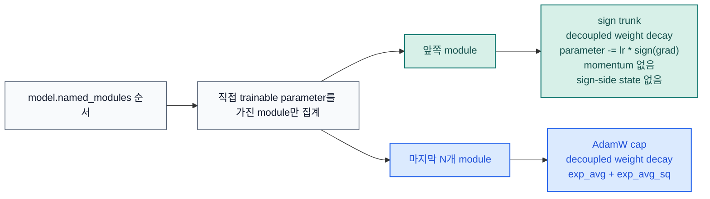

# STAC 옵티마이저 문서

[README](../../README.ko.md) |
[영문 문서](../en/optimizer.md) |
[벤치마크 JSON](../benchmark/research_benchmark.json)

STAC는 "SignSGD Trunk, AdamW Cap"의 약자입니다. 마지막 `N`개 trainable
module은 AdamW로 두고, 그보다 앞선 trainable module은 plain signSGD로
업데이트합니다. sign trunk는 의도적으로 momentum이 없고 sign 쪽 optimizer
state도 만들지 않습니다.

## 업데이트 규칙

| 구간 | 대상 module | 규칙 | 옵티마이저 state |
| --- | --- | --- | --- |
| Sign trunk | 마지막 `N`개 이전의 모든 trainable module | decoupled weight decay 후 `parameter -= lr * sign(grad)` | 없음 |
| AdamW cap | 마지막 `N`개 trainable module | 표준 AdamW | `exp_avg` + `exp_avg_sq` (+ AMSGrad max) |

STAC는 `named_parameters(recurse=False)` 기준으로 직접 trainable parameter를
소유한 module만 셉니다. `nn.Sequential` 같은 순수 컨테이너는 자기 자신이
parameter를 갖지 않으면 자동으로 건너뜁니다.

두 구간이 모두 활성화되면 sign trunk는 `sign_lr_scale * lr`, AdamW cap은 `lr`
를 사용합니다. 기본값 `sign_lr_scale=1.0`은 학습률 해석을 단순하게 유지하기
위한 값이며, sign trunk가 너무 공격적이면 더 낮추는 편이 유효한 경우가 많습니다.

## 왜 이런 설계인가

연구 근거를 보면 두 방향이 동시에 존재합니다.

- 원래 signSGD 논문은 sign-only 업데이트를 제시했고, momentum 변형이 대형
  이미지 모델에서 Adam과 비슷할 수 있다고 보고했습니다. 하지만 이 라이브러리는
  trunk를 plain signSGD로 유지하는 것이 요구사항입니다.
- error-feedback 논문은 plain signSGD가 특정 조건에서 수렴이나 일반화에
  실패할 수 있음을 보여줬습니다. 이 한계는 실제 문제입니다.
- ICLR 2025 optimizer 연구는 마지막 layer와 LayerNorm 파라미터의 adaptivity가
  성능과 학습률 안정성에 특히 중요하다고 봤습니다.

STAC는 이 소스들과 이 저장소의 CUDA 벤치마크를 함께 반영한 실용적 절충안입니다.
trunk는 textbook signSGD로 유지하되, adaptivity가 특히 중요할 가능성이 큰 tail만
AdamW로 남깁니다. normalization-heavy tail에서 AdamW cap을 넓히는 편이 유리할
수 있다는 설명은 위 논문들과 이 저장소 벤치마크를 함께 해석한 추론입니다.

## 안정성 메모

| 조절값 | 기본값 | 바꿔야 할 때 |
| --- | --- | --- |
| `last_n_modules` | `1` | 마지막 normalization과 head를 함께 adaptive하게 두고 싶을 때 |
| `sign_lr_scale` | `1.0` | sign trunk가 너무 noisy하거나 overshoot할 때 |
| `foreach` | `False` | peak memory보다 step 처리량이 더 중요할 때만 |
| `error_if_nonfinite` | `False` | `NaN` 또는 `Inf` gradient에서 즉시 실패시키고 싶을 때 |

`foreach=False`는 의도적 기본값입니다. PyTorch AdamW 문서는 foreach 경로가
CUDA에서 더 빠를 수 있지만, 중간 tensor list 때문에 peak memory를 더 쓰는
경향이 있다고 설명합니다.

## 공개 API

| 심볼 | 역할 |
| --- | --- |
| `STAC` | 하이브리드 옵티마이저 |
| `partition_trainable_modules(model, last_n_modules=1)` | trainable module을 sign/AdamW 구간으로 결정적으로 분할 |
| `ModuleGroup` | 직접 소유 파라미터 기준의 단일 trainable module slice |
| `STACPartition` | sign/AdamW 분할 결과를 이름으로 조회하는 구조체 |

실사용에서 중요한 보장:

- `model.named_modules()` 기반의 결정적 분할
- sparse gradient 명시적 거부
- sign trunk에서 sign-side optimizer state 없음
- `error_if_nonfinite=False`일 때 non-finite dense gradient step 전체 skip
- state dict 로드 시 역할, 모듈 이름, 파라미터 이름, state shape 검증
- non-capturable 모드에서 AdamW step counter를 CPU에 두어 불필요한 CUDA state 방지

## 벤치마크 근거

주요 자료:

- [벤치마크 스크립트](../../examples/research_benchmark.py)
- [JSON 결과](../benchmark/research_benchmark.json)
- [loss curve PNG](../benchmark/research_benchmark.png)

`2026-03-19`, `torch 2.10.0+cu126`, `NVIDIA GeForce RTX 3070` 스냅샷:

| 설정 | Deep regression val loss | Deep classification val acc | TailNorm val acc | Optimizer state MB | Peak delta MB |
| --- | ---: | ---: | ---: | ---: | ---: |
| `STAC` 기본 (`last_n_modules=1`) | `0.016337` | `0.7037` | `0.7926` | `0.125` | `56.118` |
| `STAC` AdamW cap 확장 (`last_n_modules=4`) | `0.015252` | `0.7092` | `0.8041` | `24.149` | `81.271` |
| `AdamW` baseline | `0.013477` | `0.7207` | `0.8051` | `98.227` | `196.459` |

이 저장소 벤치마크 방법론:

- CUDA 전용
- held-out validation split
- `5`개 paired seed
- shallow MLP 대신 깊은 residual 모델 사용
- epoch별 validation loss curve 기록
- 첫 optimization step에서 optimizer-state와 peak CUDA memory probe 측정

## 참고 문헌

- [signSGD: Compressed Optimisation for Non-Convex Problems](https://arxiv.org/abs/1802.04434)
- [Error Feedback Fixes SignSGD and other Gradient Compression Schemes](https://proceedings.mlr.press/v97/karimireddy19a.html)
- [Momentum Ensures Convergence of SIGNSGD under Weaker Assumptions](https://proceedings.mlr.press/v202/sun23l.html)
- [Decoupled Weight Decay Regularization](https://arxiv.org/abs/1711.05101)
- [Deconstructing What Makes a Good Optimizer for Autoregressive Language Models](https://openreview.net/forum?id=zfeso8ceqr)
- [PyTorch AdamW documentation](https://docs.pytorch.org/docs/stable/generated/torch.optim.AdamW.html)
