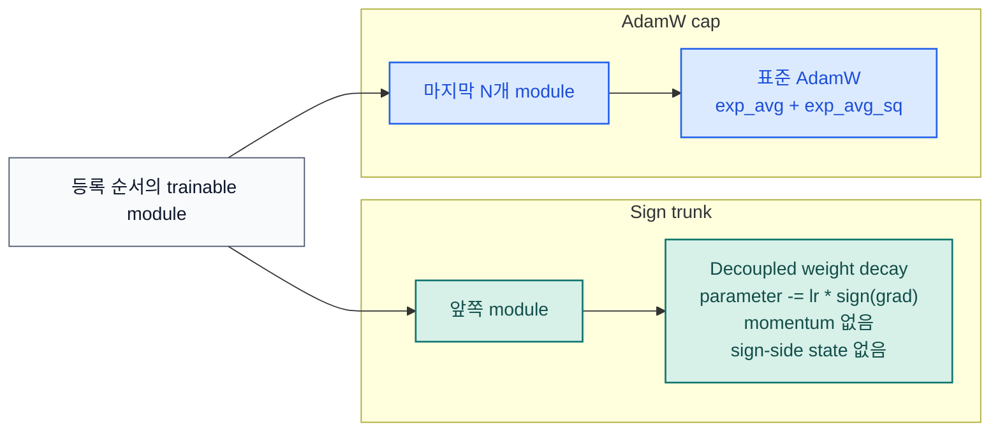

# STAC 옵티마이저 문서

[README](../../README.ko.md) |
[영문 문서](../en/optimizer.md) |
[벤치마크 JSON](../benchmark/research_benchmark.json)

STAC는 "SignSGD Trunk, AdamW Cap"의 약자입니다. 마지막 `N`개 trainable
module은 AdamW로 두고, 그보다 앞선 trainable module은 plain signSGD로
업데이트합니다. sign trunk는 의도적으로 state-free입니다. momentum, EMA,
sign-side optimizer tensor를 만들지 않습니다.

## 업데이트 규칙

| 구간 | 대상 module | 규칙 | 옵티마이저 state |
| --- | --- | --- | --- |
| Sign trunk | 마지막 `N`개 이전의 모든 trainable module | decoupled weight decay 후 `parameter -= lr * sign(grad)` | 없음 |
| AdamW cap | 마지막 `N`개 trainable module | 표준 AdamW | `exp_avg` + `exp_avg_sq` (+ AMSGrad max) |

STAC는 `named_parameters(recurse=False)` 기준으로 직접 trainable parameter를
소유한 module만 셉니다. `nn.Sequential` 같은 순수 컨테이너는 자기 자신이
parameter를 갖지 않으면 자동으로 건너뜁니다.

## 왜 이런 분할인가

연구 결과는 한쪽으로만 깔끔하게 정리되지 않습니다.

- 원래 signSGD 논문은 sign-only 업데이트를 제시했고, 대형 스케일에서 강한
  결과를 보고했습니다.
- error-feedback 논문은 plain signSGD가 특정 조건에서 수렴이나 일반화에
  실패할 수 있음을 보였습니다.
- ICLR 2025 optimizer 연구는 마지막 layer와 LayerNorm 파라미터의 adaptivity가
  성능과 학습률 안정성에 특히 중요하다고 설명합니다.

STAC는 이 제약들을 동시에 반영한 절충안입니다. trunk는 sign-side state 없이
plain signSGD로 유지하고, adaptivity가 특히 중요할 가능성이 큰 tail만 AdamW로
남깁니다.

## 안정성 튜닝 가이드

| 조절값 | 기본값 | 실전 용도 |
| --- | --- | --- |
| `last_n_modules` | `1` | adaptive tail이 너무 작으면 늘립니다 |
| `sign_weight_decay` | `weight_decay` 상속 | 분류 위주 워크로드에서 첫 튜닝 포인트입니다. 이 저장소 벤치마크에서는 `0.5 * weight_decay`가 잘 동작했습니다 |
| `sign_lr_scale` | `1.0` | sign trunk가 너무 공격적이거나 noisy하면 낮춥니다 |
| `foreach` | `False` | peak memory보다 step 처리량이 더 중요할 때만 켭니다 |
| `error_if_nonfinite` | `False` | `NaN`/`Inf` gradient에서 즉시 실패시키고 싶을 때 켭니다 |

위 `sign_weight_decay = 0.5 * weight_decay` 권장은 이 저장소 벤치마크에서
도출한 추론이며, 보편 규칙은 아닙니다.

`foreach=False`는 의도적 기본값입니다. PyTorch AdamW 문서는 foreach 경로가
CUDA에서 더 빠를 수 있지만, tensor list 중간값 때문에 peak memory를 더 쓴다고
설명합니다.

## 공개 API

| 심볼 | 역할 |
| --- | --- |
| `STAC` | 하이브리드 옵티마이저 |
| `partition_trainable_modules(model, last_n_modules=1)` | trainable module을 sign/AdamW 구간으로 결정적으로 분할 |
| `ModuleGroup` | 직접 소유 파라미터 기준의 단일 trainable module slice |
| `STACPartition` | sign/AdamW 분할 결과를 이름으로 조회하는 구조체 |

실사용에서 중요한 보장:

- `model.named_modules()` 기반의 결정적 분할
- sign trunk에서 sign-side optimizer state 없음
- sparse gradient 명시적 거부
- `error_if_nonfinite=False`일 때 non-finite dense gradient step 전체 skip
- state dict 로드 시 역할, 모듈 이름, 파라미터 이름, state shape 검증
- non-capturable 모드에서 AdamW step counter를 CPU에 두어 불필요한 CUDA state 방지

## 벤치마크 근거

주요 자료:

- [벤치마크 스크립트](../../examples/research_benchmark.py)
- [JSON 결과](../benchmark/research_benchmark.json)
- [loss curve PNG](../benchmark/research_benchmark.png)

`2026-03-19`, `torch 2.10.0+cu126`, `NVIDIA GeForce RTX 3070` 스냅샷:

| 설정 | 구성 | Deep regression val loss | Deep classification val acc | TailNorm val acc | Optimizer state MB | Peak step delta MB |
| --- | --- | ---: | ---: | ---: | ---: | ---: |
| `STAC default` | `last_n_modules=1` | `0.016294` | `0.7037` | `0.7926` | `0.125` | `7.001` |
| `STAC balanced trunk` | `last_n_modules=1`, `sign_weight_decay=0.5 * weight_decay` | `0.016114` | `0.7219` | `0.8027` | `0.125` | `7.001` |
| `STAC wider cap` | `last_n_modules=4`, `sign_weight_decay=0.5 * weight_decay` | `0.015287` | `0.7262` | `0.8029` | `24.149` | `32.153` |
| `AdamW baseline` | full AdamW | `0.013477` | `0.7207` | `0.8051` | `98.227` | `147.341` |

이 저장소 벤치마크 방법론:

- CUDA 전용
- held-out validation split
- `5`개 paired seed
- shallow toy MLP 대신 깊은 residual 모델 사용
- epoch별 validation loss curve 기록
- 첫 optimization step에서 optimizer-state와 peak step-memory probe 측정

이 저장소 기준 해석: balanced trunk는 기본값과 같은 optimizer-state 비용에서
분류 성능을 대부분 회복했고, wider cap은 더 많은 AdamW state를 쓰는 대신
회귀와 tail 쪽 품질 격차를 더 줄였습니다. 이 해석은 이 저장소 벤치마크에
기반한 것이며, 보편적 결론은 아닙니다.

## 참고 문헌

- [signSGD: Compressed Optimisation for Non-Convex Problems](https://arxiv.org/abs/1802.04434)
- [Error Feedback Fixes SignSGD and other Gradient Compression Schemes](https://proceedings.mlr.press/v97/karimireddy19a.html)
- [Decoupled Weight Decay Regularization](https://arxiv.org/abs/1711.05101)
- [Deconstructing What Makes a Good Optimizer for Autoregressive Language Models](https://openreview.net/forum?id=zfeso8ceqr)
- [PyTorch AdamW documentation](https://docs.pytorch.org/docs/stable/generated/torch.optim.AdamW.html)
